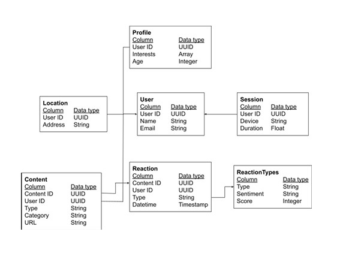
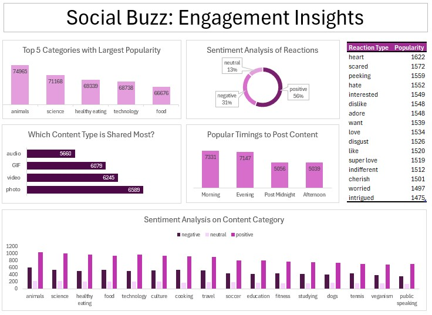

# Virtual-Internship-Accenture 


# Project Overview
Social Buzz, an anonymous social-media platform founded in 2010, has rapidly scaled to over 500 million monthly active users and generates more than 100,000 user-driven posts each day. To support their impending public offering and manage the complexities of high-velocity, unstructured data, they have engaged with accenture for an initial three-month pilot focused on strengthening their data infrastructure and strategic readiness.

Our work stream begins with a comprehensive audit of their big-data environment—examining storage, processing pipelines, and governance standards—while benchmarking against industry best practices. Subsequently, we’ll extract, integrate, and cleanse the sample engagement datasets into an Excel-driven analytics environment—enabling us to uncover operational inefficiencies, devise targeted technology optimization roadmaps, and validate data integrity.

Our final deliverables include a detailed audit report, a best-practice playbook for IPO governance, and a dashboard showcasing Social Buzz’s highest-impact content themes. Together, these will provide the strategic, technical, and regulatory foundations necessary for the platform’s next chapter of growth and public offering.

# Key Roles and Responsibilities of Data Analyst
A Data Analyst acts as a crucial bridge connecting the business and its data.
- What does this truly mean?
  - "The Business" encompasses both the client and your internal team members who may not be involved in the intricacies of data analysis.
  - These stakeholders depend on your analysis to inform critical strategic business decisions.
  - It's important to recognize that not everyone will possess a deep understanding of data.
  - Therefore, your role is to communicate your data findings in a clear and straightforward manner, ensuring they are easily understandable for everyone.
  
# Key Technical Terms
-   **Big Data**: Refers to large, diverse sets of information that grow at ever-increasing rates. It is characterized by the three V's: **volume** (the sheer amount of data), **velocity** (the speed at which it is created and collected), and **variety** (the scope of different data points covered).
-   **IPO**: Stands for **Initial Public Offering** - this occurs when a private company becomes public by selling its shares on a stock exchange.
-   **String** (data type): A sequence of characters, digits, or symbols, and is always treated as TEXT.
-   **UUID**: **Universally Unique Identifier**
-   **Array**: A list containing a number of elements in a specific order, typically of the same data type (requiring contiguous memory allocation).
-   **Timestamp**: A numerical representation of a point in time. Typically, it represents the number of seconds (or milliseconds) that have elapsed since the reference point of January 1, 1970, at 00:00:00 UTC.
-   **Integer** (data type): Numbers without fractions.

# Data Model


Based on the client's brief, we've identified three key datasets from the seven provided: the content table, the reaction table, and the reaction type table.

# Data Cleaning
**Data Cleaning Steps:**

1.  **Handling Missing Values:**
    * Removed rows with missing values.
    * Specifically, removed rows with missing values in the `reaction_type` column of the `Reactions` table (achieved using the "remove empty" function in Power Query).

2.  **Handling Irrelevant Columns:**
    * Removed columns not relevant to the task, such as `URL` and `USER ID`.

3.  **Renaming Confusing Columns:**
    * Addressed ambiguity by renaming the `type` column in each table: one to `Content Type` and the other two to `Reaction Type`.

4.  **Standardizing Inconsistent Values:**
    * Ensured uniformity in the `Content Category` column by standardizing values with inconsistent capitalization (e.g., "News" and "news").

5.  **Merging Datasets:**
    * Integrated data using merge queries in Power Query.

6.  **Creating Pivot Tables:**
    * Generated pivot tables with `Category` as rows and `Score` as values.
    * Applied "TOP N" filters on the row values.

7.  **Splitting Date and Time:**
    * Separated the datetime column into distinct date and time columns using the "Text to Columns" feature (Data tab).

8.  **Creating Time Buckets:**
    * Categorized time into the following intervals within a new `Past Time` column, likely using a conditional function like IF:
        * Morning: 05:00 - 11:59
        * Afternoon: 12:00 - 16:59
        * Evening: 17:00 - 23:59
        * Post Midnight: 00:00 - 04:59

    * The underlying logic for this categorization appears to be:
        ```
        IF(AND(A2>=TIME(0,0,0), A2<TIME(5,0,0)), "Post Midnight",
           IF(AND(A2>=TIME(5,0,0), A2<TIME(12,0,0)), "Morning",
              IF(AND(A2>=TIME(12,0,0), A2<TIME(17,0,0)), "Afternoon",
                 IF(A2>=TIME(17,0,0), "Evening", ""))))
        ```
        *(Note: `A2` is an example of cell reference containing the time value.)*

**Please refer to the transformed data Excel file to explore the detailed analysis, which includes pivot tables and further visuals.** [here](Virtual-Internship-Accenture/transformed_data.xlsx)

# Data Modeling

As per the client's brief and our analysis, the data modeling process involved integrating three key datasets: `content`, `reaction`, and `reaction type`. To achieve this, the `content` table was joined with the `reaction` table using the `contentId` as the key. Subsequently, the `reaction type` table was joined with the `reaction` table using the `reaction type` column. This structure establishes the `reaction` table as the central fact table, with `content` and `reaction type` serving as dimension tables, providing descriptive attributes for the reactions.

# Data Analysis and Uncovering Insights



The analysis of social buzz engagement reveals several key insights:

1. Content Category Performance:

Top 5 Categories by Popularity: Animal-related content significantly leads in popularity with over 74,000 engagements, followed by science, healthy eating, technology, and food. This suggests a strong audience interest in animal-related topics.

2. Optimal Engagement Timing:

Peak Activity Times: User activity peaks in the morning (around 7,331 posts) and evening (around 7,147 posts). These are identified as the most active times for content sharing, indicating optimal windows for maximizing reach and engagement.

3. Sentiment and Reaction Insights:

Overall Positive Sentiment: Despite a significant 31% negative sentiment, the majority (56%) of user reactions are positive. Neutral reactions account for 13%.
Most Popular Reaction Type: The "heart" reaction is the most popular, indicating predominantly favorable emotional responses.
Alignment of Reactions and Content: This positive reaction type aligns with the high engagement seen in animal and emotional content categories.

4. Content Type Sharing:

Most Shared Content Type: Photos are the most frequently shared content type (around 6,589 shares), closely followed by videos (around 6,245 shares), GIFs (around 6,079 shares), and audio (around 5,660 shares). This highlights the preference for visual content among users.

5. Popular Timing to Post Content:

Optimal Posting Windows: Similar to overall activity, the most popular times to post content align with morning(05:00-11:59) and evening hours(17:00-23:59). Post midnight and afternoon show lower popularity for posting.

# Business Recommendations
To leverage the engagement insights effectively, we recommend the following actions:

- **Prioritized Allocation for High-Engagement Themes:** Dedicate a significant portion of content creation and promotion efforts to emotional and educational content, recognizing their broad appeal and potential for strong engagement. Explore diverse formats and angles within these themes:
  - **Emotional Content:** Focus on content that evokes feelings such as joy (as seen with the popularity of "heart" reactions and potentially animal content or food related content), curiosity, nostalgia, or inspiration.
  - **Educational Content:** Create content that informs, explains, teaches, or shares knowledge, aligning with the popularity of science and technology.

- **Optimize Content Distribution Timing:** Schedule the primary release of content during morning and evening hours, aligning with peak user activity. Further refine posting times based on the specific content category to maximize reach and engagement.
  
- **Leverage Visual Content:** Focus on creating high-quality photo and video content, as these formats are shared most frequently. Explore engaging storytelling through visuals to capitalize on this user preference.
  
- **Reinforce Positive Emotional Connections:** The prevalence of positive sentiment, particularly the "heart" reaction, underscores the importance of emotional resonance. Continue to promote content that evokes positive emotions, especially within high-engagement categories.
